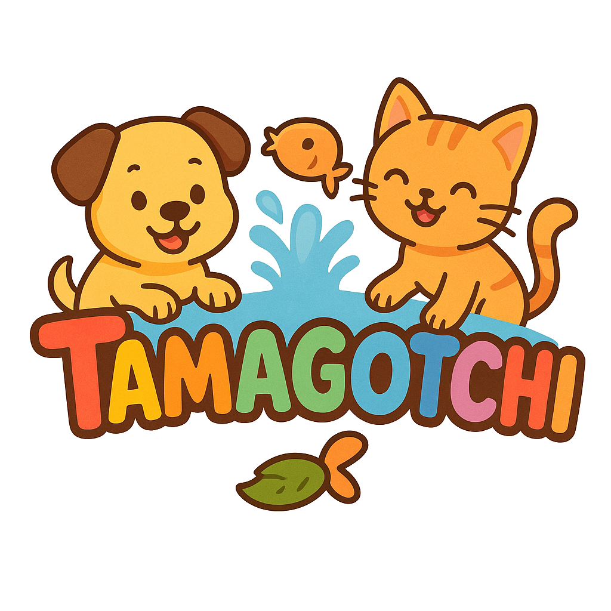
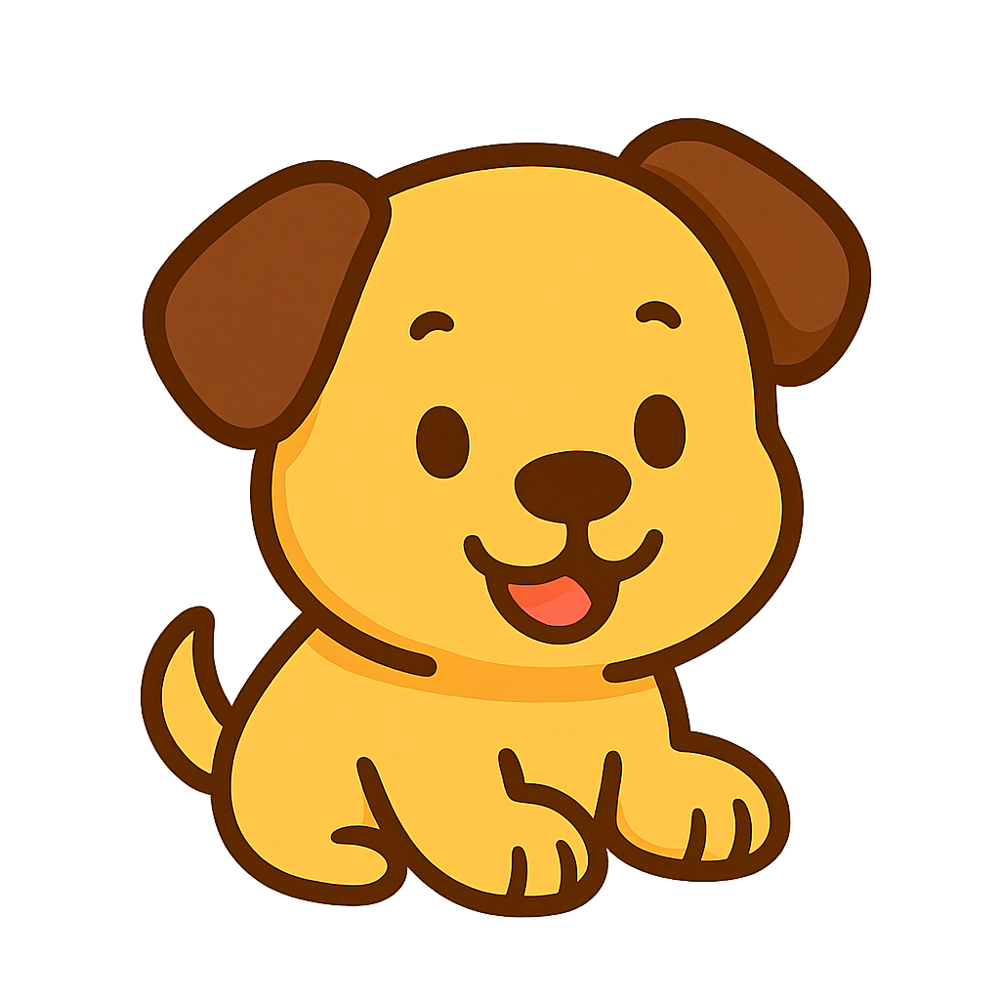
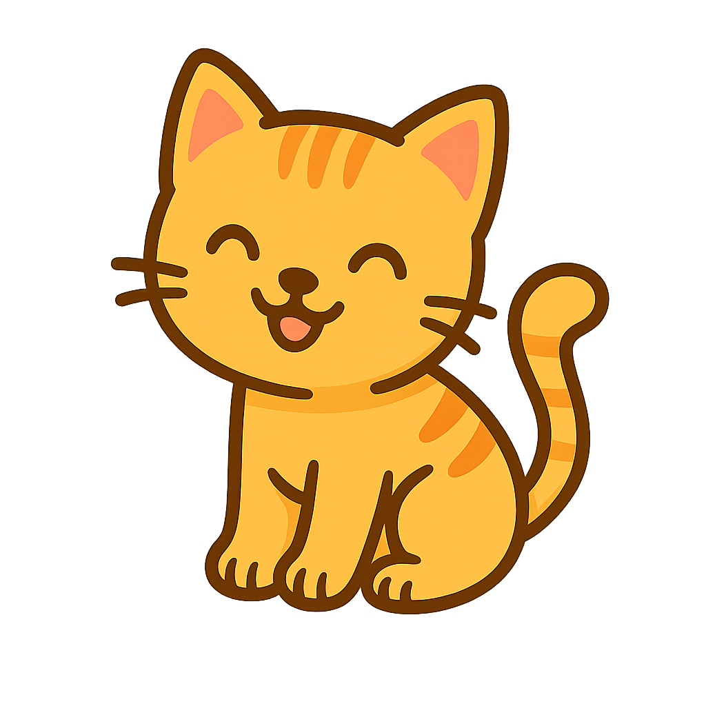
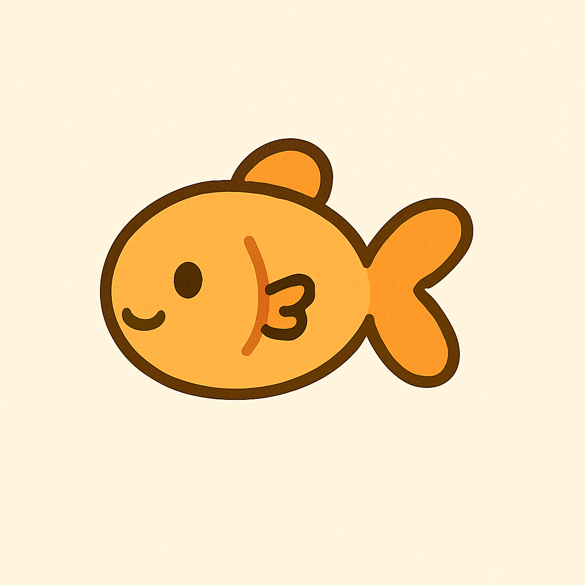

<div align="center">
  
  
  # 🎮 Tamagotchi Virtual
  ### *Projeto de Programação Orientada à Objetos*
  
  [](https://www.oracle.com/java/)
  [](https://docs.oracle.com/javase/tutorial/uiswing/)
  [](https://pt.wikipedia.org/wiki/Programa%C3%A7%C3%A3o_orientada_a_objetos)
  
  *Cuide do seu bichinho virtual e viva uma experiência nostálgica!* 🐱🐶🐠
</div>

---

## 👥 **Equipe de Desenvolvimento**

- **Diego Lopes de Oliveira** 
- **Douglas Ribeiro Costa** 
- **João Pedro Moreira da Fonseca**

---

## 📖 **Sobre o Projeto**

O **Tamagotchi Virtual** é uma reimaginação moderna do clássico bichinho virtual dos anos 90, desenvolvido como projeto acadêmico para a disciplina de Programação Orientada a Objetos. 

O jogo permite que você:
- 🍖 **Alimente** seu pet com diferentes tipos de comida
- 🎾 **Brinque** e interaja com diferentes animais
- 💤 **Cuide** da saúde, sono e felicidade
- 🏪 **Compre** itens e upgrades na loja
- 🎮 **Jogue** minigames para ganhar pontos
- 💾 **Salve** e carregue seu progresso

---

## 🐾 **Animais Disponíveis**

<div align="center">
  <table>
    <tr>
      <td align="center">
        <br>
        <b>🐶 Cachorro</b><br>
        <i>Energético e brincalhão</i>
      </td>
      <td align="center">
        <br>
        <b>🐱 Gato</b><br>
        <i>Elegante e independente</i>
      </td>
      <td align="center">
        <br>
        <b>🐠 Peixe</b><br>
        <i>Tranquilo e zen</i>
      </td>
    </tr>
  </table>
</div>

Cada animal possui características únicas, habilidades especiais e comportamentos distintos!

---

## ⚡ **Funcionalidades Principais**

### 🎯 **Sistema de Cuidados**
- **Barras de Status**: Fome, Sede, Sono, Felicidade, Saúde
- **Estados de Humor**: Baseados nas necessidades do pet
- **Sistema de Doenças**: Cuide bem ou seu pet pode ficar doente!

### 🎮 **Minigame de Digitação**
- Três níveis de dificuldade
- Sistema de pontuação dinâmico
- Ganhe pontos para comprar na loja

### 🛒 **Sistema de Loja**
- **Loja de Comidas**: Diferentes tipos de alimentos
- **Upgrades Permanentes**: Melhorias especiais para seu pet
- **Sistema de Pontos**: Economia do jogo

### 💾 **Persistência de Dados**
- Salvar/Carregar em formato CSV
- Auto-save automático
- Sistema de arquivos organizados

---

## 🛠️ **Tecnologias Utilizadas**

- **Linguagem**: Java 17+
- **Interface Gráfica**: Java Swing
- **Persistência**: Arquivos CSV
- **Paradigma**: Programação Orientada a Objetos
- **Padrões**: MVC, Observer, Factory

---

## 📂 **Estrutura do Projeto**

```
poo-trab/
├── src/
│   ├── Main.java                 # Ponto de entrada
│   ├── interfacegrafica/         # Interface gráfica
│   │   ├── imagens/             # Recursos visuais
│   │   └── *.java               # Classes da GUI
│   └── modelo/                   # Lógica do negócio
│       └── *.java               # Classes do modelo
├── saves/                        # Arquivos de save
└── README.md                     # Este arquivo
```

---

## 🚀 **Como Executar**

### **Pré-requisitos**
- Java 17 ou superior instalado
- IDE Java (IntelliJ IDEA, Eclipse, VS Code)

### **Passos para execução**

1. **Clone o repositório**
   ```bash
   git clone <url-do-repositorio>
   cd poo-trab
   ```

2. **Compile o projeto**
   ```bash
   javac -d bin src/**/*.java
   ```

3. **Execute o jogo**
   ```bash
   java -cp bin Main
   ```

4. **Ou execute diretamente pela IDE**
   - Abra o projeto na sua IDE
   - Execute a classe `Main.java`

---

## 🎯 **Requisitos Acadêmicos Implementados**

O projeto atende a todos os requisitos da disciplina:

- ✅ **Classes e Encapsulamento** (5+ classes)
- ✅ **Herança** (CriaturaVirtual → Cachorro/Gato/Peixe)
- ✅ **Polimorfismo** (Métodos sobrescritos)
- ✅ **Classe Abstrata** (CriaturaVirtual)
- ✅ **Métodos Abstratos** (emitirSom, getTipo, habilidadeEspecial)
- ✅ **Coleções** (ArrayList, HashMap)
- ✅ **Tratamento de Exceções** (TamagotchiException)
- ✅ **Interface Gráfica** (Java Swing)
- ✅ **Persistência** (Arquivos CSV)
- ✅ **Associação de Classes** (CriaturaVirtual ↔ Inventario)

---

## 🎮 **Como Jogar**

1. **Inicie o jogo** e seja bem-vindo!
2. **Escolha** criar um novo Tamagotchi ou carregar um existente
3. **Dê um nome** ao seu pet
4. **Selecione o tipo** de animal (Cachorro, Gato ou Peixe)
5. **Cuide** das necessidades básicas:
   - 🍖 Alimente quando estiver com fome
   - 💧 Dê água quando estiver com sede
   - 🛁 Dê banho para manter a higiene
   - 💤 Coloque para dormir quando cansado
6. **Interaja** com seu pet:
   - 🎾 Brinque para aumentar a felicidade
   - ⭐ Use habilidades especiais únicas
7. **Ganhe pontos** jogando o minigame de digitação
8. **Compre** comidas e upgrades na loja
9. **Acompanhe** o crescimento e bem-estar do seu pet!

---

## 🏆 **Características Especiais**

### 🎨 **Interface Intuitiva**
- Design limpo e amigável
- Barras de progresso visuais
- Cores harmoniosas e relaxantes

### 🤖 **IA Comportamental**
- Cada animal tem personalidade única
- Reações diferentes baseadas no humor
- Sistema de aging automático

### 🔄 **Sistema Dinâmico**
- Status degradam com o tempo
- Eventos aleatórios (doenças)
- Recompensas por cuidado constante

---

## 📝 **Licença**

Este projeto foi desenvolvido para fins acadêmicos como parte da disciplina de Programação Orientada a Objetos.

---

<div align="center">
  
  ### 💝 **Feito com carinho pelos estudantes** 💝
  
  *"Um Tamagotchi bem cuidado é um Tamagotchi feliz!"* 🌟
  
  ---
  
  **⭐ Se você gostou do projeto, não esqueça de dar uma estrela! ⭐**
  
</div>
